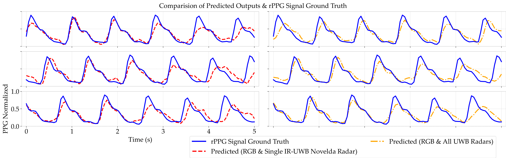
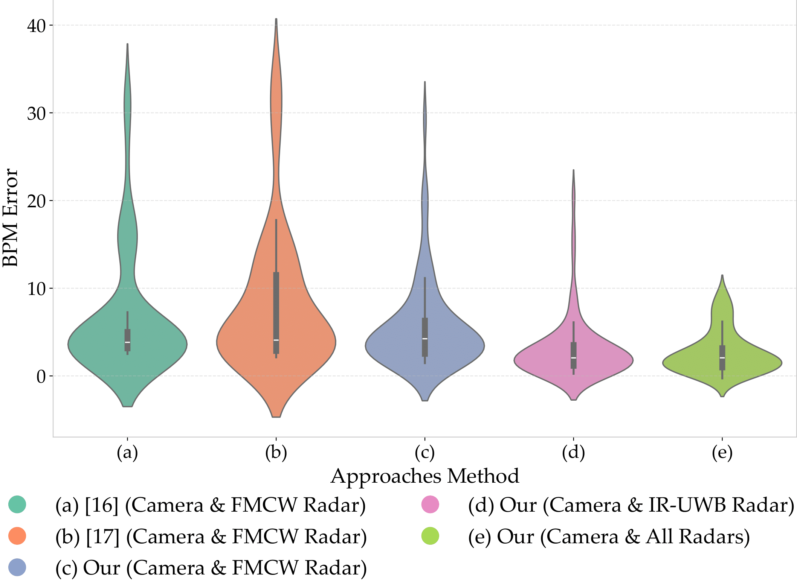

# Camera-UWB_Radars-Fusion-VitalEstimation

This repo contains code for manuscript: <span style="color:blue"><b>Multimodal Deep Learning for Remote Vital Physiological
Measurement using Camera and Radar</b></span>.

## Evaluation Metrics
### Qualitative
<p align="center">
  
</p>

<p align="center">
  <em>
    Inference Prediction Samples of the Proposed Multimodal Method using 2 cases: RGB & Single IR-UWB Novelda Radar Inputs and All Sensors (RGB & UWB Radars)
  </em>
</p>

### Quantitative
<p align="center">
  
</p>

<p align="center">
  <em>
    Comparison of BPM Error by Input Multimodal Approaches:
    This Study (Camera & FMCW, IW-UWB Radar, and All Radars) vs. Prior Works (Camera & FMCW Radar) 
    <a href="https://dl.acm.org/doi/10.1145/3528223.3530161">[16] EquiPleth</a>
    and <a href="https://arxiv.org/abs/2502.13624">[17] CardiacMamba</a>
  </em>
</p>

## Quickstart
```bash
git clone https://github.com/NguyenVanKhai2412/Camera-UWB_Radars-Fusion-VitalEstimation.git
cd Camera-UWB_Radars-Fusion-VitalEstimation
```

### 🛠 Environment
The original project was developed on python 3.10.18. We encourage you to create the same python version for reproduce purposes by creating python3.10 with conda by the following script:
```bash
conda create --name Vital python==3.10
conda activate Vital
```
***Then install all required libraries:***
```bash
pip install -r requirements.txt
```

### 📚 Training

⚠️ **Important:** Please update the default model checkpoint save directory `save_dir` and model input type `input_type` in `train.py` to adapt with your training purpose.

To train model, run this script:
```bash
python train.py
```
