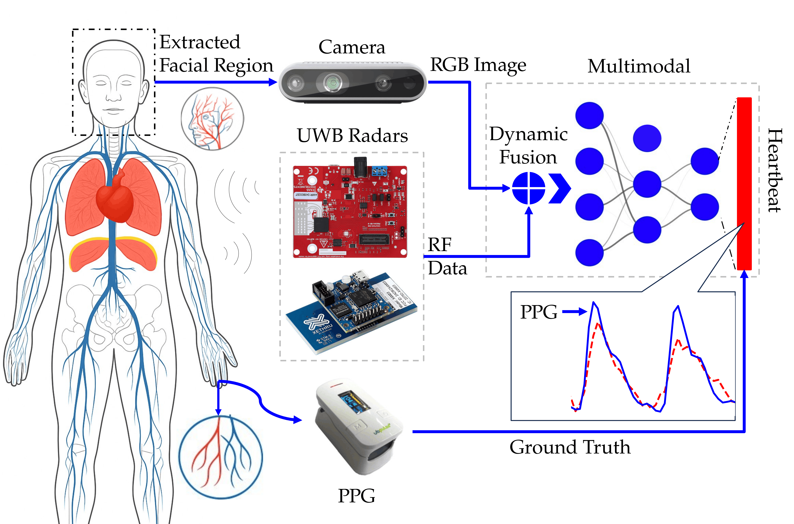
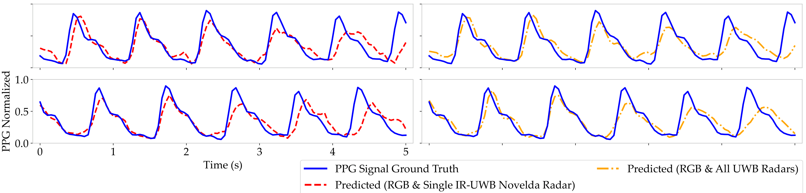
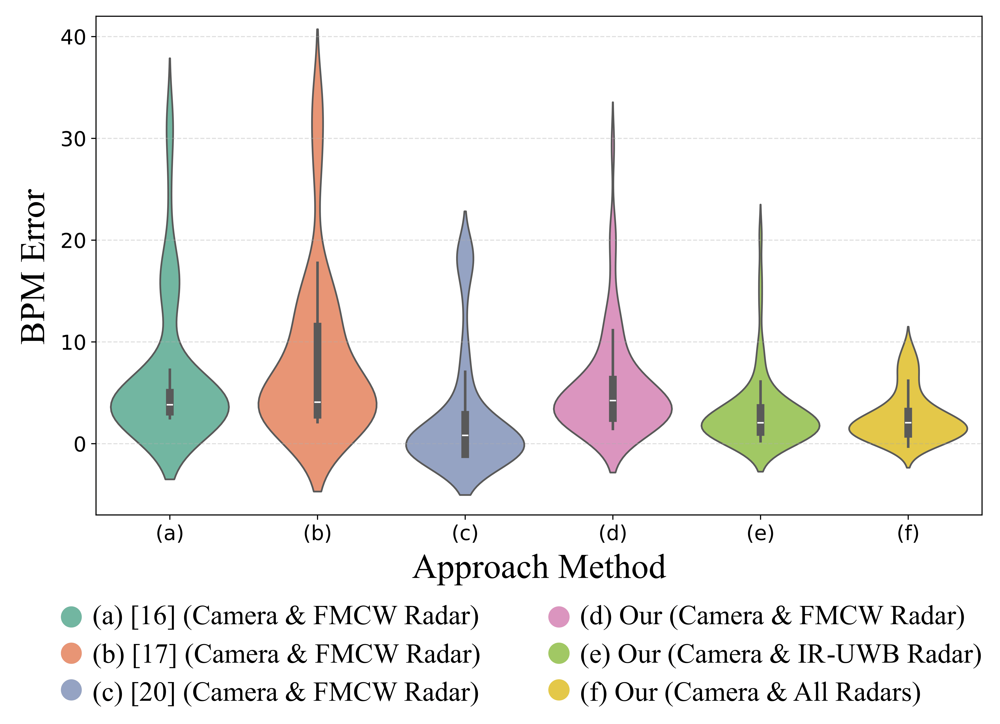

# Camera-UWB_Radars-Fusion-VitalEstimation

This repo contains code and dataset for manuscript: <span style="color:blue"><b>Multimodal Deep Learning for Remote Vital Physiological
Measurement using Camera and Radar</b></span>.

## Abstract
Non-contact vital sign measurement is crucial for improving health monitoring instruments, demonstrating high accuracy while ensuring user convenience and comfort in clinical, home, and remote environments. While camera-based remote photoplethysmography (rPPG) and ultra-wideband (UWB) radar micro-motion sensing offer promising approaches, each faces limitations from environmental factors—cameras from illumination and skin variability, and radars from motion artifacts and multipath effects. In this paper, we propose a dynamic deep fusion approach for integrating synchronized RGB and RF signals, combining cross-modal complementary features to reconstruct PPG waveforms under realistic conditions. We also introduce a multimodal instrumentation benchmark dataset—the first combining visual and multi-type UWB radar measurements (one FMCW and two IR-UWB sensors for sensing diversity) with ground-truth PPG—collected from 17 subjects at varying distances (0.5–1.5 m), angles (-45° to +45°), and activities (resting and phone use). The dataset enables comprehensive evaluation of fusion strategies across varying sensing conditions and subject behaviors. Evaluated on a subset corresponding to the nominal sensing configuration (0.5 m distance, 0° viewing angle, and resting condition), our fusion system achieves an MAE of 0.1029, an MSE of 0.0152, and a heart-rate estimation error of 2.651 ± 2.430 BPM, surpassing unimodal and static fusion baselines. These results demonstrate improved signal fidelity and noise robustness, supporting applications in advanced instrumentation, telemetry, and pervasive monitoring systems.
<p align="center">
  
</p>

<p align="center">
  <em>
    General architecture of the proposed system for remote cardiac signal monitoring using multimodal sensors
  </em>
</p>

## Evaluation Metrics
### Qualitative
<p align="center">
  
</p>

<p align="center">
  <em>
    Inference Prediction Samples of the Proposed Multimodal Method using 2 cases: RGB & Single IR-UWB Novelda Radar Inputs and All Sensors (RGB & UWB Radars)
  </em>
</p>

### Quantitative
<p align="center">
  
</p>

<p align="center">
  <em>
    Comparison of BPM Error by Input Multimodal Approaches:
    This Study (Camera & FMCW, IW-UWB Radar, and All Radars) vs. Prior Works (Camera & FMCW Radar) 
    <a href="https://dl.acm.org/doi/10.1145/3528223.3530161">[16] EquiPleth</a>,
    <a href="https://arxiv.org/abs/2502.13624">[17] CardiacMamba</a>
    and <a href="https://doi.org/10.1145/3746027.3754594">[20] Evidential-Phys</a>
  </em>
</p>

## Quickstart
```bash
git clone https://github.com/NguyenVanKhai2412/Camera-UWB_Radars-Fusion-VitalEstimation.git
cd Camera-UWB_Radars-Fusion-VitalEstimation
```

### 🛠 Environment
The original project was developed on python 3.10.18. We encourage you to create the same python version for reproduce purposes by creating python3.10 with conda by the following script:
```bash
conda create --name Vital python==3.10
conda activate Vital
```
***Then install all required libraries:***
```bash
pip install -r requirements.txt
```

### 📚 Training

⚠️ **Important:** Please update the default model checkpoint save directory `save_dir` and model input type `input_type` in `train.py` to adapt with your training purpose.

To train model, run this script:
```bash
python train.py
```
